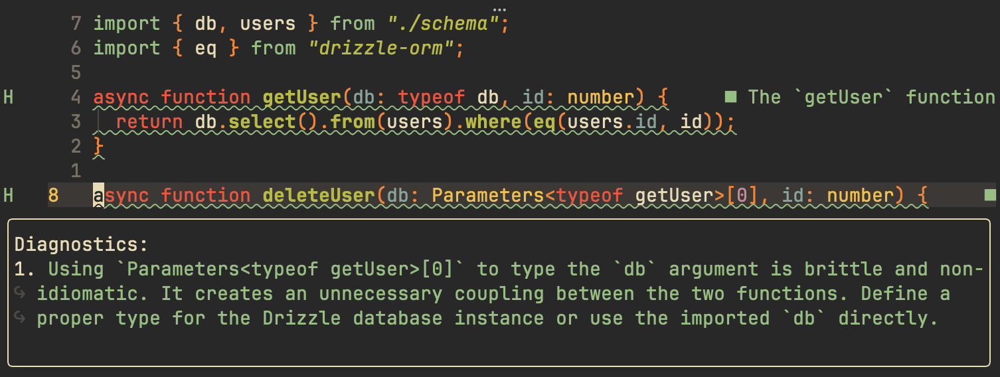

# lll - large language lint

Queries an LLM to get some lint messages that your other linters miss.
Not quite a code review, but an okay first pass.
Some diagnostics may be hallucinated.

## Install

Build from source:

```bash
cargo install --path .
```

Requires a Gemini API key. Either:

- export `GEMINI_API_KEY` in the environment, or
- write `gemini_api_key = "..."` to `~/.config/lll/config.toml` (`chmod 600` recommended).

If both are set, the env var wins. The config file is more reliable for
GUI-launched editors (e.g. VSCode opened from Spotlight) where shell env
vars don't always propagate.

## Usage

```bash
lll <file> [<file>...]              # pretty output (default)
lll --format editor <file>          # file:line:col:end_line:end_col: severity: message
```

Each file is a separate API call; multi-file just iterates.

## Editor integration



### Neovim (nvim-lint)

Add `lll` as a custom linter and trigger it on save. The `editor` format is
designed for `from_pattern`:

```lua
local lint = require("lint")

lint.linters.lll = {
  cmd = "lll",
  stdin = false,
  args = { "--format", "editor" },
  append_fname = true,
  ignore_exitcode = true,
  parser = require("lint.parser").from_pattern(
    [[([^:]+):(%d+):(%d+):(%d+):(%d+): (%w+): (.+)]],
    { "file", "lnum", "col", "end_lnum", "end_col", "severity", "message" },
    {
      error = vim.diagnostic.severity.ERROR,
      warning = vim.diagnostic.severity.WARN,
      suggestion = vim.diagnostic.severity.HINT,
    },
    { ["source"] = "lll" },
    { end_col_offset = 0 }
  ),
}

vim.api.nvim_create_autocmd("BufWritePost", {
  callback = function()
    if vim.bo.modifiable then
      lint.try_lint("lll")
    end
  end,
})
```

`lll` is intentionally save-only — every save is one Gemini call. Putting it
in `linters_by_ft` would also fire on `BufEnter` / `InsertLeave`, which burns
API quota for little benefit.
